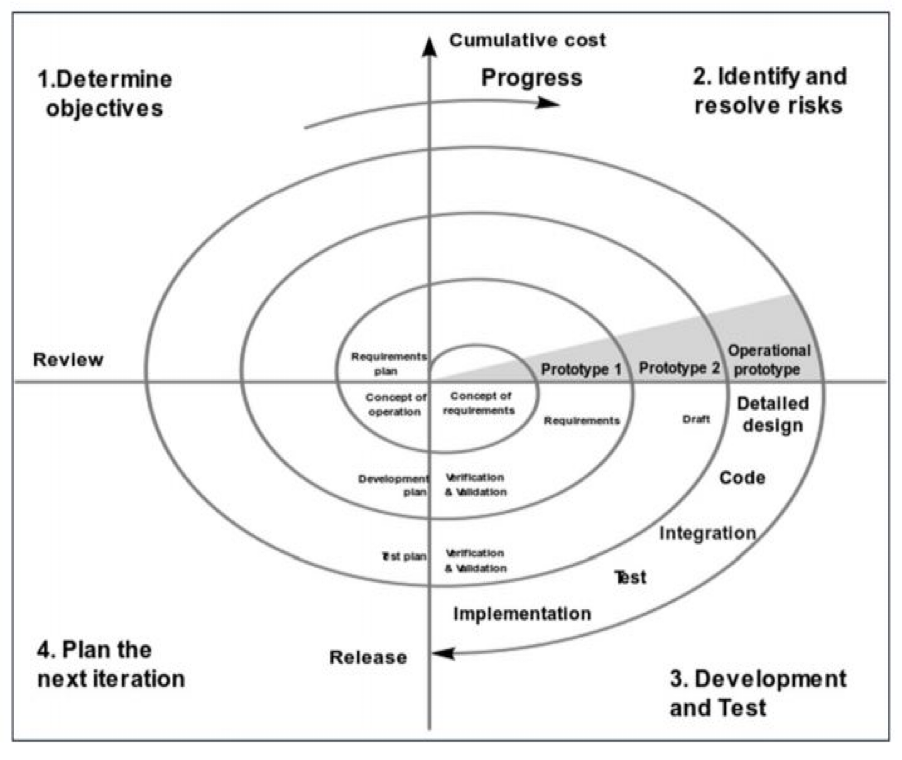
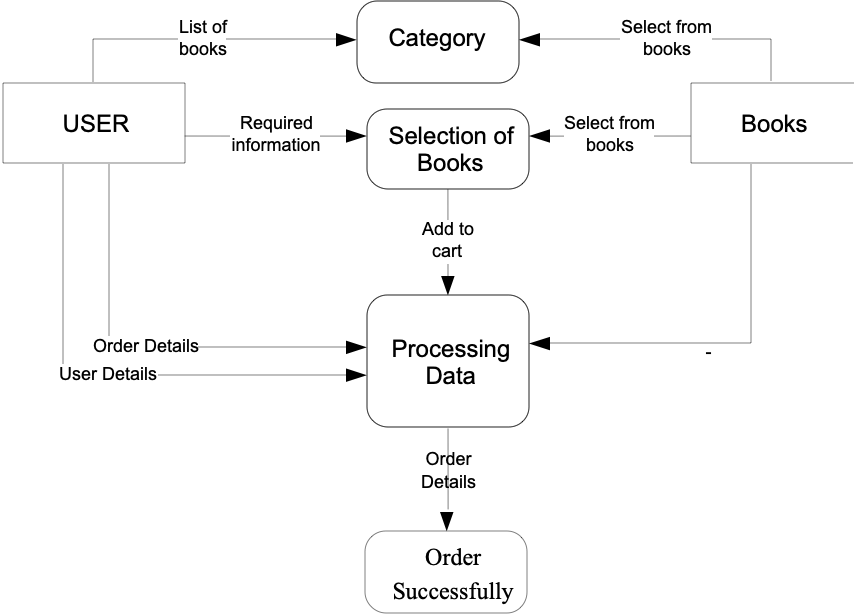
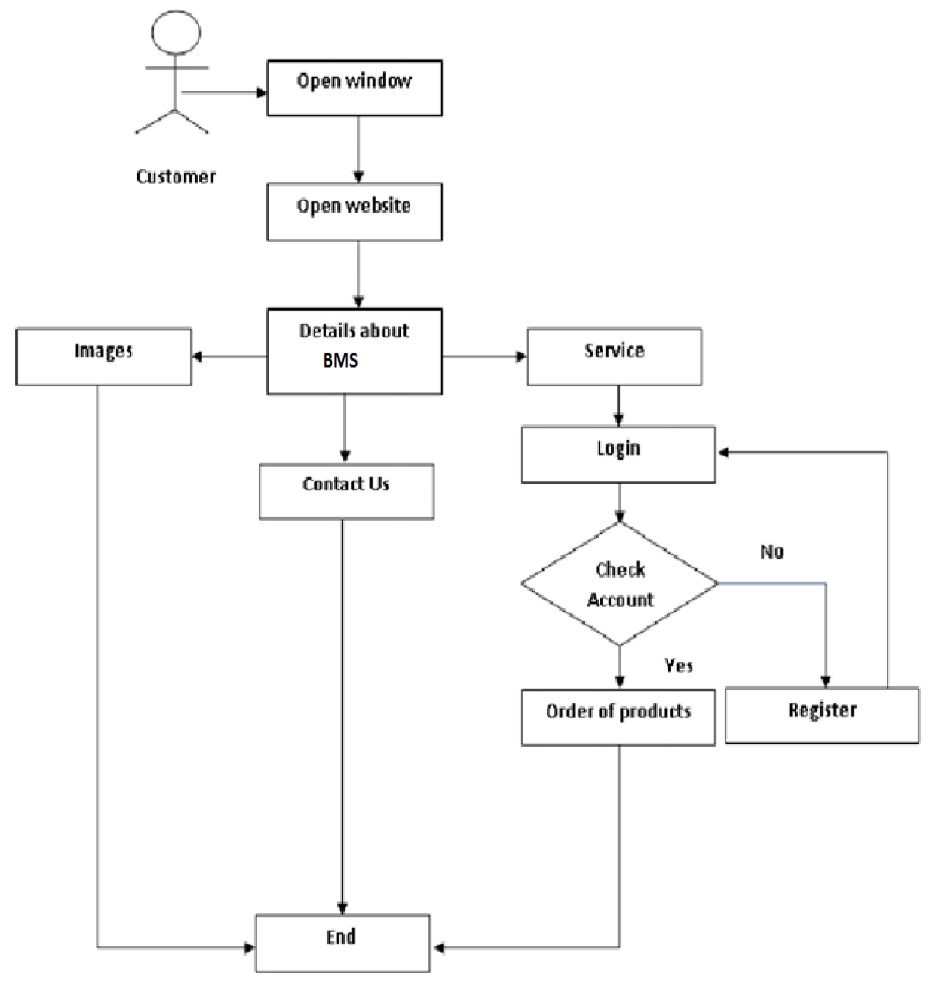
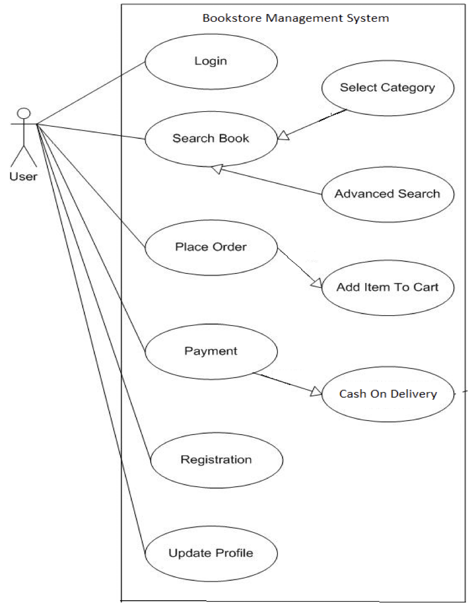
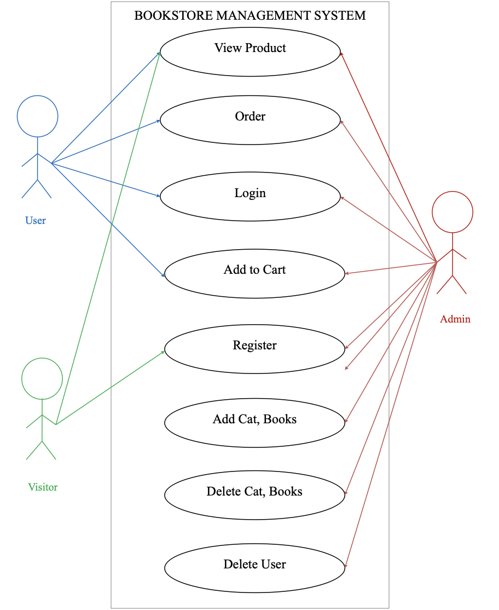

# Könyvesbolt kezelési rendszer
## Tartalomjegyzék

1. [Bevezetés](#1-bevezetés)
   1.1 [Projekt háttere](#11-projekt-háttere)
   1.2 [Projekt céljai](#12-projekt-céljai)
   1.3 [Projekt hatóköre](#13-projekt-hatókör)
   1.4 [Projekt alkalmazhatósága](#14-projekt-alkalmazhatósága)
2. [Követelmények és analízis](#2-követelmények-és-analízis)
   2.1 [Probléma analízis](#21-probléma-analízis)
   2.2 [Elvárások](#22-elvárások)
       - [Admin funkciók](#admin-funkciók)
       - [Felhasználói funkciók](#felhasználói-funkciók)
   2.3 [Hardverkövetelmények](#23-hardverkövetelmények)
   2.4 [Szoftverkövetelmények](#24-szoftverkövetelmények)
3. [Tervezés és ütemezés](#3-tervezés-és-ütemezés)
4. [Használt technológiák](#6-használt-technológiák)
   4.1 [Frontend](#frontend)
   4.2 [Backend](#backend)
5. [Rendszerszervezés](#7-rendszerszervezés)
6. [Adatbázis struktúra](#8-adatbázis-struktúra)
   6.1 [Admin](#admin)
   6.2 [Book](#book)
   6.3 [Category](#category)
   6.4 [Contact](#contact)
   6.5 [Register](#register)
   6.6 [Order](#order)

## 1. Bevezetés
### 1.1. Projekt háttere
- A szoftver lehetővé teszi az adminisztrátor számára, hogy tárolja a könyvek és a vásárlók adatait.
- Könnyebb hozzáférést biztosít az olyan információkhoz, mint a vásárlók adatai és a könyvek elérhetősége.
- Lehetőséget biztosít az adatok tárolására a papírmunka csökkentése érdekében.
- A könyvesbolt kezelési rendszerében a felhasználók könyvet vásárolhatnak, az adminisztrátor pedig megjeleníti a nevüket és egyéb hátterüket.
- Egy új ötlet arról, hogyan működik a könyvesbolt kezelési rendszer.
- A rendszer számítógépesítésére irányul.

### 1.2. Projekt céljai
- A papírmunka csökkentése érdekében.
- A rendszer számítógépesítése.
- Az üzemeltetési sebesség növelése.
- Gyorsabb keresés és nagyobb pontosság.
- Nagy mennyiségű adat tárolása adatbázis használatával.
- A járművek kézi vásárlási és eladási folyamata, pénzügyi és készpénzes ügyletek, valamint a modell szerinti heti, havi és éves jelentések generálása rendkívül nehéz, így ez a projekt megkönnyíti azt.
- Gyorsabb információ-visszakeresés.

### 1.3. Projekt hatóköre
- A rendszer szándéka, hogy csökkentse a túlórás fizetést és növelje a pontosan kezelhető rekordok számát; a dokumentumban szereplő követelmények funkcionális és nem funkcionális jellegűek.
- Pontos és helyes keresés, amely a keresési művelet alkalmazásával adja meg az eredményt.
- Az ügyfelek néhány kattintással lefoglalhatnak egy könyvet.
- Rugalmasságot biztosít az adminisztrátornak az adatbázis hatékony használatához, és lehetővé teszi a szövegszerkesztő, a jegyzetfüzet és a számológép használatát.
- Egyértelmű és minden szinten érthető.

### 1.4 Projekt alkalmazhatósága
- Azok számára, akik könyveket szeretnének vásárolni bárhol és bármikor.
- Az adminisztrátor feladata a könyvek beillesztése és a könyvek listázása.
- Az adatbázis az adatok tárolására és lekérdezésére szolgál, így mind a felhasználók, mind az adminisztrátor hozzáférhetnek vagy olvashatják az adatokat.

## 2. Követelények és analízis
### 2.1. Probléma analízis
- Túl sok papírmunka.
- Az eljárás túl időigényes.
- További költségek a papírmunkában.
- Nagy mennyiségű adat tárolása.
- A járművek kézi vásárlási és eladási folyamata, pénzügyi és készpénzes ügyletek, valamint a modell szerinti heti, havi és éves jelentések generálása rendkívül nehéz.
- Gyorsabb információ-visszakeresés.
- Az pontosság és a következetesség alacsonyabb a manuális rendszerben.
- Személyes késedelem.
- A manuális rendszerben fáradságos feladat egy adott rekord későbbi megkeresése.
- A vizsgálat során több munkatársra van szükség, ami az idejük pazarlásával jár.

### 2.2 Elvárások 
2 modul:
1. Admin
2. Felhasználó

#### Admin funkciók
- Kategória hozzáadása
- Kategórialista
- Új könyv hozzáadása
- Könyv megtekintése
- Üzenetek megtekintése, amelyeket az ügyfél küldött

#### Felhasználói funkciók
- Könyvek megtekintése
- Könyvek hozzáadása a kosárhoz
- Könyvek keresése
- Tételek megtekintése vagy hozzáadása a kosárban

### 2.3. Hardverkövetelmények 
- Processzor: PC kétmagos processzorral vagy annál jobb ajánlott. Ajánlott: 2,20 GHz-es processzor
- RAM: 512 MB vagy annál több ajánlott
- Merevlemez: 45 MB szabad hely szükséges a rendszermeghajtón vagy annál több

### 2.4. Szoftverkövetelmények
- 32 bites operációs rendszer
- Windows 7/8/8.1/10
- Linux  Ubuntu / Light ubuntu
- Mac OS
- Wamp Server
- MySQL
- Browser
- PHPMyAdmin

## 3. Tervezés és ütemezés
A projektciklus egyes szakaszaihoz különböző időmennyiségre lehet szükség, attól függően, hogy a projektciklus kulcsfontosságú szempontjai hogyan ismétlődnek a fejlesztési folyamat során. Az előfejlesztési fázis követelményeinek összegyűjtése során szerzett információk lendületet adnak a követelmény-elemzésnek, és ezeket az információkat a tervezési fázisban is felhasználják.

| Azonosító | Feladat neve     | Kezdés/Befejezés           | Időtartam  |
|-----------|------------------|----------------------------|------------|
| 1         | Elemzés          | 2018.12.25 - 2019.01.01    | 8 nap      |
| 2         | Tervezés         | 2019.01.01 - 2019.01.09    | 9 nap      |
| 3         | Kódolás          | 2019.01.10 - 2019.02.08    | 4 hét      |
| 4         | Megvalósítás     | 2019.02.08 - 2019.02.12    | 5 nap      |
| 5         | Tesztelés        | 2019.02.12 - 2019.02.17    | 6 nap      |
| 6         | Dokumentáció     | 2019.02.18 - 2019.03.10    | 3 hét      |

A fenti ütemterv meghatározza a különböző szoftverfejlesztési fázisokhoz szükséges becsült időt, figyelembe véve az összes helyzeti tényezőt. A csapattagok technikailag készen állnak, néhány napos képzést elfogadva a technológiai ismeretek megszerzése érdekében. Így a számítások szerint időben megvalósítható a megoldás kiépítése. „Az ütemtervet minden fázis végén felülvizsgáljuk és szükség szerint frissítjük.”

### Spirál modell

A fenti ütemterv meghatározza a különböző szoftverfejlesztési fázisokhoz szükséges becsült időt, figyelembe véve az összes helyzeti tényezőt. A csapattagok technikailag készen állnak, néhány napos képzést elfogadva a technológiai ismeretek megszerzése érdekében. Így a számítások szerint időben megvalósítható a megoldás kiépítése. „Az ütemtervet minden fázis végén felülvizsgáljuk és szükség szerint frissítjük.”

## 6. Használt technológiák
### Frontend
1. HTML
2. CSS
3. Bootstrap

### Backend
1. PHP
2. MySQL

## 7. Rendszerszervezés
### Weboldal
Weboldal folyamatábra

Felhasználói folyamatábra

Weboldal használati eset diagram

Rendszer használati eset diagram

## 8. Adatbázis struktúra
A következő táblázatok léteznek:
- Admin
- Book
- Category
- Contact
- Register
- Order

### Admin
| Mező     | Típus       | Leírás                              |
|----------|-------------|-------------------------------------|
| A_id     | int(4)      | Adminisztrátor ID tárolására        |
| A_unm    | Varchar(3)  | Adminisztrátor felhasználónév tárolására |
| A_pwd    | Varchar(30) | Adminisztrátor jelszó tárolására    |

### Book
| Mező   | Típus        | Leírás                                                            |
|--------|--------------|-------------------------------------------------------------------|
| B_id   | Int(10)      | Könyv ID tárolására                                               |
| B_nm   | Varchar(50)  | Könyv nevének tárolására                                          |
| B_cat  | Int(6)       | Különböző kategóriák könyv ID-jának kiválasztására vagy tárolására |
| B_desc | Longtext     | A könyv leírásának tárolására nagy mennyiségű adat formájában     |
| B_price| Int(4)       | Könyv árának tárolására                                           |
| B_img  | Varchar(50)  | Könyv képének nevének tárolására                                  |
| B_time | Int(20)      | A beillesztett könyv idejének tárolására                          |

### Category
| Mező   | Típus       | Leírás                           |
|--------|-------------|----------------------------------|
| Cat_id | Int(10)     | Kategória ID tárolására         |
| Cat_nm | Varchar(50) | Kategória nevének tárolására    |

### Contact
| Mező   | Típus       | Leírás                                        |
|--------|-------------|-----------------------------------------------|
| C_id   | Int(4)      | Ügyfél/Felhasználó kapcsolat ID tárolására   |
| C_fnm  | Varchar(100)| Felhasználó teljes nevének tárolására        |
| C_mno  | Int(10)     | Ügyfél/Felhasználó mobiltelefonszámának tárolására |
| C_email| Varchar(60) | Ügyfél/Felhasználó e-mail címének tárolására |
| C_msg  | Longtext    | Ügyfél/Felhasználó üzenetének vagy kérdésének tárolására |
| C_time | Varchar(20) | A kapcsolatfelvételi űrlap adatainak beillesztési idejének tárolására |

### Register
| Mező   | Típus       | Leírás                                        |
|--------|-------------|-----------------------------------------------|
| R_id   | Int(8)      | Felhasználói regisztrációs ID tárolására     |
| R_fnm  | Varchar(100)| Felhasználó teljes nevének tárolására        |
| R_unm  | Varchar(50) | Felhasználónév tárolására                     |
| R_pwd  | Varchar(30) | Felhasználó jelszavának tárolására           |
| R_cno  | Varchar(10) | Felhasználó kapcsolati számának tárolására    |
| R_email| Varchar(60) | Felhasználó e-mail címének tárolására        |
| R_time | Varchar(20) | Felhasználó regisztráció idejének tárolására |

### Order
| Mező      | Típus        | Leírás                                     |
|-----------|--------------|--------------------------------------------|
| O_id      | Int(11)      | Megrendelés ID tárolására                 |
| O_name    | Varchar(30)  | Felhasználó teljes nevének tárolására     |
| O_address | Varchar(200) | Felhasználó címének tárolására            |
| O_pincode | Int(20)      | Városi irányítószám tárolására            |
| O_city    | Varchar(30)  | Város nevének tárolására                  |
| O_state   | Varchar(30)  | Állam tárolására                           |
| O_mobile   | Bigint(20)   | Mobiltelefonszám tárolására               |
| O_rid     | Int(8)       | Regisztrációs ID tárolására                |

